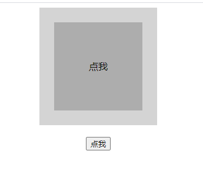

# 事件循环

浏览器中的事件循环
JavaScript代码的执行过程中，除了依靠函数调用栈来搞定函数的执行顺序外，还依靠任务队列(task queue)来搞定另外一些代码的执行。整个执行过程，我们称为事件循环过程。一个线程中，事件循环是唯一的，但是任务队列可以拥有多个。任务队列又分为macro-task（宏任务）与micro-task（微任务），在最新标准中，它们被分别称为task与jobs。

macro-task大概包括：

- script(整体代码)

- setTimeout

- setInterval

- setImmediate

- I/O

- UI render

micro-task大概包括:

- process.nextTick

- Promise

- Async/Await(实际就是promise)

- MutationObserver(html5新特性)


执行宏任务，然后执行该宏任务产生的微任务，若微任务在执行过程中产生了新的微任务，则继续执行微任务，微任务执行完毕后，再回到宏任务中进行下一轮循环。


详细了解可以查看此[网站](https://jakearchibald.com/2015/tasks-microtasks-queues-and-schedules/)逐步调试。

案例一：

```js
console.log('script start');

setTimeout(function () {
  console.log('setTimeout');
}, 0);

Promise.resolve()
  .then(function () {
    console.log('promise1');
  })
  .then(function () {
    console.log('promise2');
  });

console.log('script end');

// 输出 
//script start 
//script end
//promise1
//promise2
//setTimeout
```


案例二：



```html
<!--html-->
<div class="outer">
  <div class="inner">点我</div>
</div>
<button class="btn">点我</button>
```

```js
// js
   const outer = document.querySelector(".outer");
      const inner = document.querySelector(".inner");
      const btn = document.querySelector(".btn");

      new MutationObserver(function () {
        console.log("mutate outer");
      }).observe(outer, {
        attributes: true,
      });

      function onClick() {
        console.log("click");

        setTimeout(function () {
          console.log("timeout");
        }, 0);

        Promise.resolve().then(function () {
          console.log("promise");
        });

        outer.setAttribute("data-random", Math.random());
      }

      inner.addEventListener("click", onClick);
      outer.addEventListener("click", onClick);

      btn.addEventListener("click", () => {
        inner.click();
      });


// 单击inner输出
//click
//promise
//mutate outer
//click
//promise
//mutate outer
//timeout
//timeout

// 单击btn输出
//click
//click
//promise
//mutate outer
//promise
//timeout

// 浏览器派发是2个task干，代码执行1个task干2次
```

