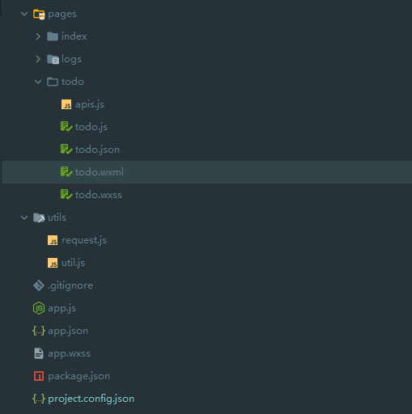
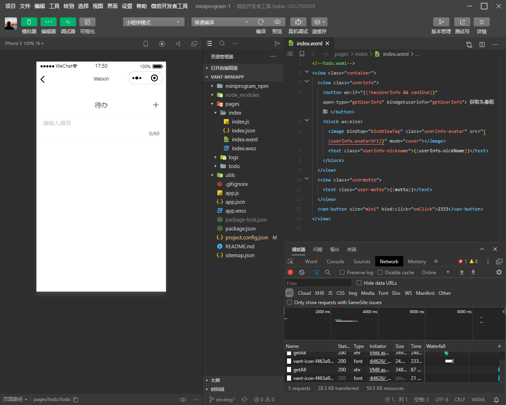

## Taro开发微信小程序(Taro、React、TypeScript)

### 目录结构



使用vant组件时必须要在`app.json`中先进行声明才可以用，而且需要在微信开发者工具中开启`npm构建`，开启方法是顶部工具栏 => 工具 => 构建npm；

```json
{
  "pages":[
    "pages/index/index",
    "pages/todo/todo",
    "pages/logs/logs"
  ],
  "window":{
    "backgroundTextStyle":"light",
    "navigationBarBackgroundColor": "#fff",
    "navigationBarTitleText": "Weixin",
    "navigationBarTextStyle":"black"
  },
  "sitemapLocation": "sitemap.json",
  "usingComponents": {
    "van-button": "@vant/weapp/button/index",
    "van-nav-bar": "@vant/weapp/nav-bar/index",
    "van-cell-group": "@vant/weapp/cell-group/index",
    "van-field": "@vant/weapp/field/index",
    "van-icon": "@vant/weapp/icon/index",
    "van-image": "@vant/weapp/image/index",
    "van-checkbox": "@vant/weapp/checkbox/index",
    "van-cell": "@vant/weapp/cell/index",
    "van-swipe-cell": "@vant/weapp/swipe-cell/index"
  }
}

```




> todo.wxml

```html
<!--todo.wxml-->
<view>
  <van-nav-bar class="nav-bar" title="待办" bind:click-right="onClickRight">
      <van-icon name="plus" size="18" slot="right" />
  </van-nav-bar>
  <van-swipe-cell wx:for="{{allTodoList}}" wx:key="{{item._id}}">
    <van-cell>
        <van-checkbox v-model="item.completed" label-disabled bind:change="(isChecked) => { onCheckChange(isChecked, item) }" >{{item.content}}</van-checkbox>
    </van-cell>
    <van-button slot="right" square type="danger" bind:click="() => { deleteTodo(item) }" text="删除" />
  </van-swipe-cell>
  <van-dialog v-model="show" title="填写待办" bind:confirm="saveToDoList" show-cancel-button show-confirm-button>
  <van-field
    v-model="message"
    rows="2"
    autosize
    type="textarea"
    maxlength="60"
    placeholder="请输入留言"
    show-word-limit
  />
  </van-dialog>
</view>

```

> todo.js

```js
// todo.js
// 获取应用实例
const app = getApp()

const { GetToDoList, ChangeStatus, DeleteById } = require('./apis');

Page({
  data: {
    show: false,
    allTodoList: [],
    todoList: [],
  },
  onLoad() {
    console.log('sssss')
    this.getTodoList();
  },
  getTodoList(cb) {
    GetToDoList().then(res => {
      const allTodoList = res;
      const todoList = res.filter(x => !x.completed);
      this.setData({
        allTodoList,
        todoList,
      })
      cb && cb();
    })
  },
  deleteTodo(data) {
    const { _id } = data;
    DeleteById({ _id }).then(res => {
      Notify({ type: 'success', message: '删除成功' });
      this.getTodoList();
    })
  },
  onCheckChange(isChecked, item) {
    const { _id, completed } = item
    ChangeStatus({ _id, completed }).then(res => {
      console.log(res)
    });
  },
  onClickRight() {
    this.setData({
      show: true
    })
  },
})

```


没错，这个项目又鸽了。。。

感觉微信小程序写着麻烦且用不上~相比于webApp还是webApp更方便~   

d[o_0]b