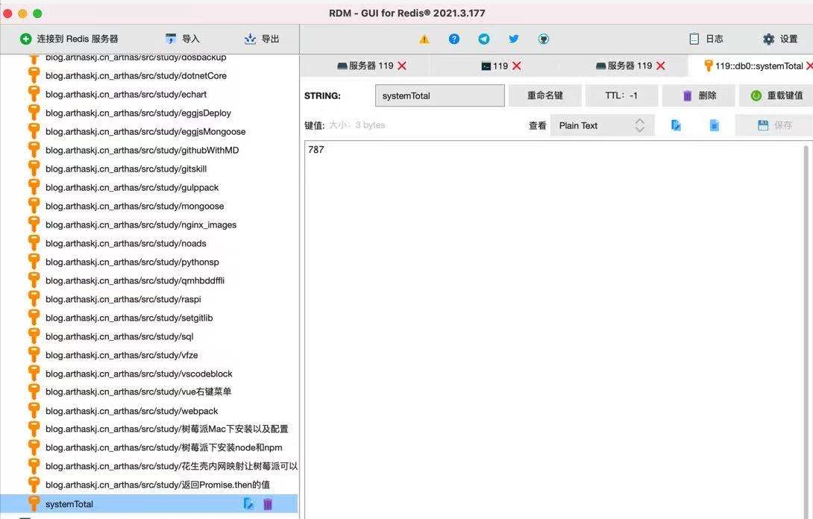

# 开发浏览量统计接口-使用redis替换mongodb

更改前

```js
  async UpdateStorage(params) {
    const { host, hash } = params;
    const data = await this.ctx.model.Storage.findOne({ host, hash });
    let d = data;
    if (!data) {
      d = { ...params, sv: 0, pv: 0 };
    }
    let { sv = 0, pv = 0 } = d;
    sv++; pv++;

    const dd = { host, hash, sv, pv };

    if (!data) {
      dd.updateTime = this.ctx.helper.dateFormat(new Date(), 'YYYY/mm/dd HH:MM:SS');
      await this.ctx.model.Storage.create(dd);
    } else {
      await this.ctx.model.Storage.updateOne({ host, hash }, dd);
    }
    const datas = await this.ctx.model.Storage.find({ host });
    dd.sv = datas.map(x => x.pv).reduce((a, b) => a + b);
    return dd;
  }
```

更改后

```js
async UpdateStorage(params) {
    const { host, hash } = params;
    const redisKey = `${host}_${hash}`;
    let systemTotal = await this.service.redis.get('systemTotal') || 0;
    let pageTotal = await this.service.redis.get(redisKey) || 0;

    systemTotal++;
    pageTotal++;

    await this.service.redis.set('systemTotal', systemTotal);
    await this.service.redis.set(redisKey, pageTotal);

    return { host, hash, sv: systemTotal, pv: pageTotal };
}
```


封装redis方法

```js
const { Service } = require('egg');

class RedisService extends Service {
  /**
   * 存储
   * @createTime 2021-04-20 14:01:15
   */
  async set(key, value, seconds) {
    // seconds 有效时长
    const { redis } = this.app;
    value = JSON.stringify(value);
    if (!seconds) {
      await redis.set(key, value);
    } else {
      // 设置有效时间
      await redis.set(key, value, 'EX', seconds);
    }
  }

  /**
   * 获取
   * @createTime 2021-04-20 14:00:59
   */
  async get(key) {
    const { redis } = this.app;
    let data = await redis.get(key);
    if (!data) return;
    data = JSON.parse(data);
    return data;
  }

  async flushAll() {
    const { redis } = this.app;
    redis.flushall();
  }
}

module.exports = RedisService;

```


同步mongodb数据到redis

```js
// 将mongodb的浏览量数据同步到redis
this.app.redis.set('kj', 'is a cool boy!');
const datas = await this.ctx.model.Storage.find({ host: 'blog.arthaskj.cn' });
datas.forEach(x => {
    const { host, hash, pv } = x;
    this.service.redis.set(`${host}_${hash}`, pv);
});
this.service.redis.set('systemTotal', datas.map(x => x.pv).reduce((a, b) => a + b));
```


效果

